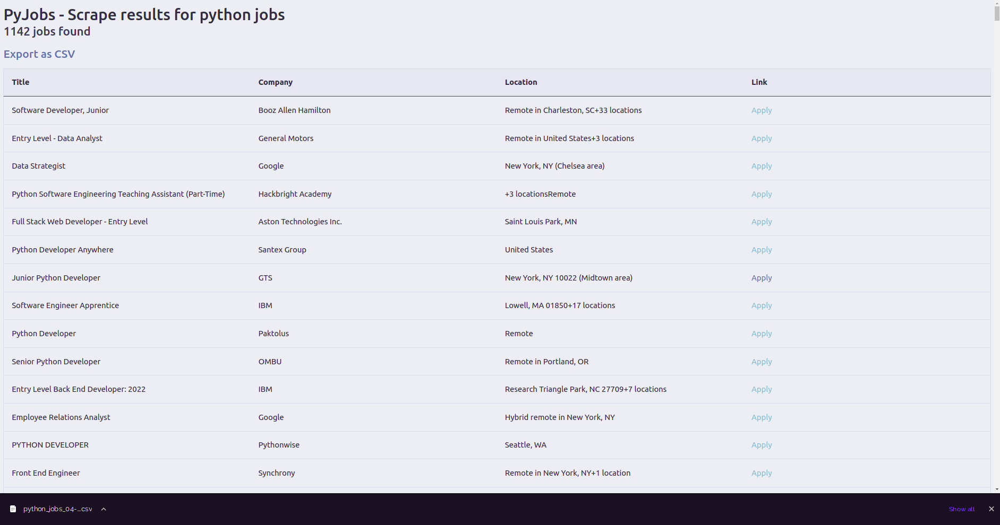

# [Nomad Coders - PyJobs](https://nomadcoders.co/python-for-beginners)

<p align="center">
  
</p>

## Table of Contents

- [About](#about)
- [Getting Started](#getting_started)
- [License](#license)
- [Packages](#packages)
- [Docs](#docs)
- [Resources](#resources)

## About <a name = "about"></a>

A job scraper in Python.

- [Take the course too!](https://nomadcoders.co/python-for-beginners)
- [Certificate of Completion]()

## Features

- [x] Scrape Indeed jobs
- [x] Scrape Stack Overflow jobs
- [x] Save to `.csv`
- [ ] Run scrapes asynchronously

## Getting Started <a name = "getting_started"></a>

### Prerequisites

- `python >= 3.9.0`

### Installation

1. Clone this repo locally and install the required packages:

```bash
$ git clone https://github.com/librity/nc_pyjobs.git
$ cd nc_pyjobs
$ pip install requests beautifulsoup4 Flask
```

2. Run `main.py` with `python3`:

```bash
$ python3 src/main.py
```

### Format

You can install and run `black`:

```bash
$ pip install black
$ black .
```

Or you can use the
[official VSCode extension](https://marketplace.visualstudio.com/items?itemName=ms-python.python)
that uses `autopep8` by default.

## License <a name = "license"></a>

This project is [MIT licensed](LICENSE).

## Packages <a name = "packages"></a>

- https://pypi.org/
- https://github.com/psf/black
- https://github.com/psf/requests
- https://www.crummy.com/software/BeautifulSoup/
- https://github.com/pallets/flask

## Docs <a name = "docs"></a>

- https://docs.python.org/3.9/
- https://docs.python.org/3/library/index.html
- [math - Mathematical functions](https://docs.python.org/3/library/math.html)
- [datetime - Basic date and time types](https://docs.python.org/3/library/datetime.html)
- [csv - CSV File Reading and Writing](https://docs.python.org/3/library/csv.html)
- [json - JSON encoder and decoder](https://docs.python.org/3/library/json.html)
- https://flask.palletsprojects.com/en/2.0.x/

## Resources <a name = "resources"></a>

### Python

- https://www.python.org/
- https://wiki.python.org/moin/BeginnersGuide
- https://www.upgrad.com/blog/python-cheat-sheet/
- https://namingconvention.org/python/
- https://blog.finxter.com/python-one-line-return-if/
- https://chercher.tech/python-questions/check-number-integer-python-questions
- https://instructobit.com/tutorial/108/How-to-share-global-variables-between-files-in-Python
- https://pynative.com/python-timestamp/
- https://www.educba.com/python-async/
- https://www.javatpoint.com/python-join-list

### W3 Schools

- https://www.w3schools.com/python/python_booleans.asp
- https://www.w3schools.com/python/python_lists.asp
- https://www.w3schools.com/python/python_tuples.asp
- https://www.w3schools.com/python/python_dictionaries.asp
- https://www.w3schools.com/python/gloss_python_remove_list_items.asp
- https://www.w3schools.com/python/python_classes.asp
- https://www.w3schools.com/python/module_math.asp
- https://www.w3schools.com/python/python_inheritance.asp

### Stack Overflow

- https://stackoverflow.com/questions/69447823/how-to-convert-array-to-string-in-python
- https://stackoverflow.com/questions/52665596/equivalent-of-package-json-and-package-lock-json-for-pip
- https://stackoverflow.com/questions/54430470/vs-code-python-autopep8-does-not-honor-2-spaces-hanging-indentation
- https://stackoverflow.com/questions/3553740/what-is-the-python-equivalent-of-rubys-inspect
- https://stackoverflow.com/questions/37848340/how-to-skip-a-single-loop-iteration-in-python
- https://stackoverflow.com/questions/11264684/flatten-list-of-lists
- https://stackoverflow.com/questions/3086973/how-do-i-convert-this-list-of-dictionaries-to-a-csv-file
- https://stackoverflow.com/questions/60171502/requests-get-is-very-slow
- https://stackoverflow.com/questions/51568874/how-to-create-string-with-line-breaks-in-python
- https://stackoverflow.com/questions/46471418/replace-only-first-line-of-text-file-in-python

### Geeks for Geeks

- https://www.geeksforgeeks.org/template-class-in-python/
- https://www.geeksforgeeks.org/private-methods-in-python/
- https://www.geeksforgeeks.org/python-program-to-find-largest-number-in-a-list/

### Targets

- https://stackoverflow.com/jobs
- https://www.indeed.com/advanced_search

### Style Guide

- https://www.python.org/dev/peps/pep-0008/?
- https://books.agiliq.com/projects/essential-python-tools/en/latest/linters.html

### Flask

- https://palletsprojects.com/p/flask/

### Django

- https://www.djangoproject.com/
- https://github.com/django/django

### HTML

- https://www.w3schools.com/html/html_tables.asp

### CSS

- https://minicss.org/
